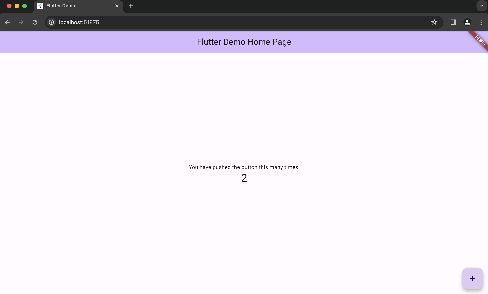

# My_Learning-Dart

Learn everything about dart lang for Flutter to build cross-platform apps

## Description

<u>Objective</u>: To learn how to create flutter apps so that I can plugin Rust code behind via C FFI. I actually didn't find any such platform like Flutter other than Qt.

## Installation

### CLI | dart
>
> For macOS M1.

- Install via package manager:

```sh
brew tap dart-lang/dart
brew install dart
```

- To upgrade:

```sh
brew upgrade dart
```

- To install a specific version:

```sh
brew install dart@3.1
```

- List installed dart versions:

```sh
brew info dart
```

- Switch to a specific version:

```sh
# unlink the current version
brew unlink dart@2.1

# link the desired version
brew link dart@3.1
```

### VSCode extension

1. Install [Flutter](https://marketplace.visualstudio.com/items?itemName=Dart-Code.flutter) extension.
2. <kbd>Cmd+Shift+P</kbd> to open command palette and choose "Flutter: New Project".
3. Now, it searches for flutter SDK. If not installed, then it will install on CLI seeking your permission via dialog prompt.

## Quickstart

### Dart App

This is to learn dart lang.

```sh
# create project
$ dart create -t console my_dart_app

# change to directory
$ cd my_dart_app

# run app
$ dart run
Building package executable... 
Built my_dart_app:my_dart_app.
Hello world: 42!
```

Now, you can write dart code and practice 🧑‍💻🎉.

### Flutter App

This is to build Flutter apps for any platform.

1. Choose "Flutter: New Project" in VSCode Command Palette.
2. It then asks for choosing a template:

  

  Suppose, you select 'Application'.

3. And then it asks for destination folder.
4. Finally, it asks for project name.
5. Now, it will create a Flutter project in your desired folder.
6. Then, it will open the project in VSCode in a new window.
7. Now, you can build your Flutter app and practice 🧑‍💻🎉.

```sh
flutter run 
Downloading Web SDK...                                              5.9s
Downloading darwin-x64/FlutterMacOS.framework tools...              4.9s
Downloading darwin-x64/gen_snapshot tools...                       843ms
Downloading darwin-x64-profile/FlutterMacOS.framework tools...         3.6s
Downloading darwin-x64-profile tools...                            553ms
Downloading darwin-x64-profile/gen_snapshot tools...               843ms
Downloading darwin-x64-release/FlutterMacOS.framework tools...         3.2s
Downloading darwin-x64-release tools...                            522ms
Downloading darwin-x64-release/gen_snapshot tools...               933ms
Connected devices:
macOS (desktop) • macos  • darwin-arm64   • macOS 14.4.1 23E224 darwin-arm64
Chrome (web)    • chrome • web-javascript • Google Chrome 124.0.6367.62

No wireless devices were found.

[1]: macOS (macos)
[2]: Chrome (chrome)
Please choose one (or "q" to quit): 2
Launching lib/main.dart on Chrome in debug mode...
Waiting for connection from debug service on Chrome...              9.9s
This app is linked to the debug service: ws://127.0.0.1:64137/72GU810bCOE=/ws
Debug service listening on ws://127.0.0.1:64137/72GU810bCOE=/ws

🔥  To hot restart changes while running, press "r" or "R".
For a more detailed help message, press "h". To quit, press "q".

A Dart VM Service on Chrome is available at: http://127.0.0.1:64137/72GU810bCOE=
The Flutter DevTools debugger and profiler on Chrome is available at: http://127.0.0.1:9101?uri=http://127.0.0.1:64137/72GU810bCOE=
Application finished.
```

It installs all the dependencies and runs the app that looks like this:


Congrats! 🎉

Likewise, you can also select "macOS" for desktop app that looks like this:


## dart

### CLI

#### Analyze

Analyze Dart code just like `cargo check` in rust.

```sh
dart analyze
Analyzing my_dart_app...               0.5s

warning • bin/my_dart_app.dart:6:7 • The value of the local variable 'name' isn't used. Try removing the variable or using it. • unused_local_variable
warning • bin/my_dart_app.dart:7:7 • The value of the local variable 'year' isn't used. Try removing the variable or using it. • unused_local_variable
warning • bin/my_dart_app.dart:8:7 • The value of the local variable 'antennaDiameter' isn't used. Try removing the variable or using it. • unused_local_variable
warning • bin/my_dart_app.dart:9:7 • The value of the local variable 'flybyObjects' isn't used. Try removing the variable or using it. • unused_local_variable
warning • bin/my_dart_app.dart:10:7 • The value of the local variable 'image' isn't used. Try removing the variable or using it. • unused_local_variable

5 issues found.
```

for code:

```dart
  var name = 'Abhi';
  var year = 2024;
  var antennaDiameter = 3.7;
  var flybyObjects = ['Jupiter', 'Saturn', 'Uranus', 'Neptune'];
  var image = {
    'tags': ['saturn'],
    'url': '//path/to/saturn.jpg',
  };
```

#### doc

```sh
# doesn't create any output folder
dart doc --dry-run

# creates output folder
dart doc

# creates output folde to specified path
dart doc --output=docs
```

### Language

- `var` used like `let mut` in rust, `let` in typescript for auto type inference.

## References

- [Dart for developers](https://dart.dev/)
- [Flutter for developers](https://flutter.dev/)
